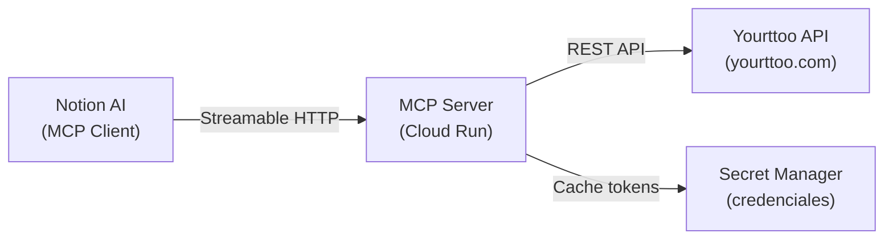

<aside>
🎯

**Objetivo**: Crear un servidor MCP (Model Context Protocol) que exponga la API de Yourttoo como herramientas consumibles por Notion AI y otros clientes MCP. Desplegado en Google Cloud Run.

</aside>

---

## 1. Arquitectura General



- **Protocolo**: Streamable HTTP (recomendado) + fallback SSE
- **URL pública**: `https://mcp-yourttoo-XXXX.run.app/mcp`
- **Autenticación MCP**: OAuth 2.0 / Bearer token
- **Autenticación Yourttoo**: email + password → accessToken (cacheado)

---

## 2. Stack Tecnológico

| **Componente** | **Tecnología** | **Justificación** |
| --- | --- | --- |
| Runtime | Node.js 20 LTS | SDK MCP oficial en TypeScript |
| Framework MCP | `@modelcontextprotocol/sdk` | SDK oficial de Anthropic para MCP servers |
| HTTP Framework | Express.js o Hono | Ligero, compatible con Cloud Run |
| Hosting | Google Cloud Run | Serverless, escala a 0, capa gratuita generosa |
| Secretos | Google Secret Manager | Credenciales Yourttoo seguras |
| Container | Docker | Requerido por Cloud Run |
| IDE desarrollo | Google Antigravity | Vibe coding + deploy directo a Cloud Run |

---

## 3. Endpoints de la API Yourttoo

La API de Yourttoo tiene 4 endpoints principales. Todos son `POST` y requieren headers de autenticación tras el login.

### 3.1 Autenticación — `POST /auth`

<aside>
🔑

**Base URL**: `https://www.yourttoo.com/apidocs`

</aside>

**Request:**

```json
{
  "email": "tu_email@agencia.com",
  "password": "tu_password"
}
```

**Response:**

```json
{
  "userid": "57555df9a2caebcc63b4d8b9",
  "accessToken": "$2a$10$o3XXFpMdU1pgqD2MB5Gi/eD76de6gLL7RTMafw7CihZA4FJns60eq"
}
```

**Headers requeridos en todas las llamadas posteriores:**

```
userid: <userid obtenido>
accesstoken: <accessToken obtenido>
Content-Type: application/json
```

> 💡
>
> **Actualización Crítica Auth**: El proceso de login real de Yourttoo es a través de `/auth/login` (no `/auth`). El servidor devuelve un `userid`, un `accessToken` y establece una cookie de sesión `connect.sid`. El cliente MCP (YourttooClient.ts) ha sido actualizado para capturar y reenviar esta cookie, ya que la API interna la requiere.
>
> Además, se ha implementado un sistema de **Autenticación Proactiva** que realiza el login con email/password antes de la primera petición, evitando depender de tokens estáticos en el `.env`.

</aside>

### 3.2 Estado Actual y Bloqueos

> [!CAUTION]
> **Bloqueo por Autorización de API**
> 
> Aunque el flujo de autenticación está corregido y funcional, la cuenta `info@safetour.es` recibe actualmente un error del servidor de Yourttoo al intentar consumir datos:
> 
> *   **API B2B (api.yourttoo.com):** *"Your account has not been authorized yet for using this API url"*.
> *   **API Interna (www.yourttoo.com):** *"Error en BACK.PROCESS"* (bloqueado para acceso programático).
> 
> **Acción Pendiente:** Esperar a que Yourttoo habilite el acceso a la API B2B para esta cuenta.

### 3.3 Inventario de Recursos — `POST /find`

Devuelve catálogos maestros del sistema.

**Request:**

```json
{
  "type": "countries" // opciones: "countries", "cities", "providers", "tags"
}
```

**Response (ejemplo para cities):**

```json
{
  "_id": "5a3b2c1d...",
  "countrycode": "JP",
  "label_en": "Tokyo",
  "label_es": "Tokio",
  "slug": "tokyo",
  "country": "5a3b2c1d...",
  "location": {
    "latitude": 35.6762,
    "longitude": 139.6503
  }
}
```

### 3.3 Búsqueda de Programas — `POST /search`

Búsqueda paginada con filtros.

**Request (todos los campos opcionales salvo indicado):**

```json
{
  "countries": ["id_pais_1", "id_pais_2"],
  "cities": ["id_ciudad_1"],
  "tags": ["id_tag_1"],
  "providers": ["id_proveedor_1"],
  "minprice": 500,
  "maxprice": 3000,
  "mindays": 5,
  "maxdays": 15,
  "page": 1,
  "maxresults": 12
}
```

**Response:**

```json
{
  "totalItems": 47,
  "pages": 4,
  "currentpage": 1,
  "items": [
    {
      "id": "abc123",
      "code": "YTTJP-2026",
      "title": "Japón Esencial 12 días",
      "categoryname": "Circuitos",
      "description": "Recorrido por las principales ciudades...",
      "minprice": 1890,
      "currency": "EUR",
      "minpaxopertaion": 2,
      "release": 15,
      "flights": {
        "arrival": { "iata": "NRT", "city": "Tokyo", "label": "(NRT) Narita - Tokyo" },
        "departure": { "iata": "KIX", "city": "Osaka", "label": "(KIX) Kansai - Osaka" }
      },
      "pricesbymonth": [
        { "month": "September", "year": 2026, "minprice": 1890, "currency": "EUR" }
      ]
    }
  ]
}
```

### 3.4 Detalle de Programa o Reserva — `POST /fetch`

Descarga el detalle completo.

**Request:**

```json
{
  "type": "program",   // "program" o "booking"
  "code": "YTTJP-2026" // código del programa o localizador de reserva
}
```

**Response (programa — campos principales):**

```json
{
  "id": "abc123",
  "code": "YTTJP-2026",
  "title": "Japón Esencial 12 días",
  "description": "...",
  "minprice": 1890,
  "currency": "EUR",
  "cancelpolicy": "Cancelación gratuita hasta 30 días antes...",
  "importantnotes": "Visado no requerido para españoles...",
  "included": {
    "arrivaltransfer": { "included": true, "description": "Traslado aeropuerto-hotel" },
    "departuretransfer": { "included": true, "description": "Traslado hotel-aeropuerto" },
    "tourescort": { "included": true, "spanish": true, "english": true },
    "transportbetweencities": { "bus": { "included": true }, "train": { "included": true } }
  },
  "itinerary": [
    {
      "description": "Día 1: Llegada a Tokyo. Traslado al hotel.",
      "departure": { "city": "Tokyo", "country": "Japón" },
      "sleep": { "city": "Tokyo", "country": "Japón" },
      "hotel": { "name": "Shinjuku Washington", "category": "4*" },
      "meals": { "breakfast": false, "lunch": false, "dinner": true },
      "activities": [
        { "title": "Traslado al hotel", "group": true, "ticketsincluded": true }
      ]
    }
  ],
  "availability": [
    {
      "year": 2026,
      "months": [
        {
          "month": "September",
          "days": [
            { "day": 5, "single": 2490, "double": 1890, "triple": 1790 },
            { "day": 12, "single": 2490, "double": 1890, "triple": 1790 }
          ]
        }
      ]
    }
  ],
  "provider": { "code": "PROV01", "company": { "name": "Tourasia" } }
}
```

---

## 4. Tools MCP a Implementar

Cada tool se expone como una función invocable por el cliente MCP (Notion AI).

### 4.1 `search_programs`

<aside>
🔍

**Propósito**: Buscar programas/circuitos en el catálogo de Yourttoo

</aside>

| **Parámetro** | **Tipo** | **Requerido** | **Descripción** |
| --- | --- | --- | --- |
| `destination` | string | No | Nombre del país o ciudad (se resuelve a ID internamente) |
| `tags` | string[] | No | Categorías: "playa", "cultural", "aventura", etc. |
| `min_price` | number | No | Precio mínimo por persona en EUR |
| `max_price` | number | No | Precio máximo por persona en EUR |
| `min_days` | number | No | Duración mínima en días |
| `max_days` | number | No | Duración máxima en días |
| `page` | number | No | Página de resultados (default: 1) |

**Lógica interna:**

1. Recibe `destination` como texto legible (ej: "Japón")
2. Llama a `/find` con `type: "countries"` para resolver el ID del país
3. Si no encuentra país, busca en `/find` con `type: "cities"`
4. Llama a `/search` con los IDs resueltos + filtros
5. Devuelve lista formateada con: título, precio desde, duración, aeropuertos, proveedor

### 4.2 `get_program_detail`

<aside>
📋

**Propósito**: Obtener el detalle completo de un programa específico

</aside>

| **Parámetro** | **Tipo** | **Requerido** | **Descripción** |
| --- | --- | --- | --- |
| `code` | string | **Sí** | Código del programa en Yourttoo (ej: "YTTJP-2026") |

**Retorna:**

- Título y descripción
- Itinerario día a día (ciudades, hoteles, comidas, actividades)
- Servicios incluidos/no incluidos
- Información de vuelos (aeropuertos llegada/salida)
- Política de cancelación
- Notas importantes
- Proveedor

### 4.3 `check_availability`

<aside>
📅

**Propósito**: Consultar disponibilidad y precios de un programa para fechas concretas

</aside>

| **Parámetro** | **Tipo** | **Requerido** | **Descripción** |
| --- | --- | --- | --- |
| `code` | string | **Sí** | Código del programa |
| `month` | string | No | Mes (ej: "September") |
| `year` | number | No | Año (ej: 2026) |

**Retorna:**

- Fechas de salida disponibles
- Precios por tipo de habitación (individual, doble, triple)
- Días de antelación necesarios (release)
- Mínimo de pasajeros

### 4.4 `get_inventory`

<aside>
🗂️

**Propósito**: Obtener catálogos maestros (países, ciudades, tags, proveedores)

</aside>

| **Parámetro** | **Tipo** | **Requerido** | **Descripción** |
| --- | --- | --- | --- |
| `resource_type` | string | **Sí** | Tipo: `countries`, `cities`, `providers`, `tags` |

### 4.5 `get_booking`

<aside>
🎫

**Propósito**: Consultar el detalle de una reserva existente por su localizador

</aside>

| **Parámetro** | **Tipo** | **Requerido** | **Descripción** |
| --- | --- | --- | --- |
| `locator` | string | **Sí** | Localizador de la reserva en Yourttoo |

---

## 5. Estructura del Proyecto

```
mcp-yourttoo/
├── src/
│   ├── index.ts              # Entry point, configura MCP server
│   ├── server.ts             # Definición del MCP server y registro de tools
│   ├── tools/
│   │   ├── searchPrograms.ts      # Tool: search_programs
│   │   ├── getProgramDetail.ts    # Tool: get_program_detail
│   │   ├── checkAvailability.ts   # Tool: check_availability
│   │   ├── getInventory.ts        # Tool: get_inventory
│   │   └── getBooking.ts          # Tool: get_booking
│   ├── api/
│   │   ├── yourttooClient.ts      # Cliente HTTP para Yourttoo API
│   │   └── auth.ts                # Gestión de autenticación y cache de token
│   ├── utils/
│   │   ├── resolvers.ts           # Resolución nombre → ID (países, ciudades)
│   │   └── formatters.ts          # Formateo de respuestas para el LLM
│   └── config.ts             # Variables de entorno y configuración
├── Dockerfile
├── package.json
├── tsconfig.json
├── .env.example
└── README.md
```

---

## 6. Código Base — Esqueleto del Server

### 6.1 Entry Point (`src/index.ts`)

```tsx
import { McpServer } from "@modelcontextprotocol/sdk/server/mcp.js";
import { StreamableHTTPServerTransport } from "@modelcontextprotocol/sdk/server/streamableHttp.js";
import express from "express";
import { registerTools } from "./server";

const app = express();
const PORT = process.env.PORT || 8080;

// Cloud Run usa PORT env var
app.use(express.json());

app.post("/mcp", async (req, res) => {
  const server = new McpServer({
    name: "yourttoo-mcp",
    version: "1.0.0",
  });

  registerTools(server);

  const transport = new StreamableHTTPServerTransport({ sessionIdGenerator: undefined });
  await server.connect(transport);
  await transport.handleRequest(req, res, req.body);
});

// Health check para Cloud Run
app.get("/health", (req, res) => res.json({ status: "ok" }));

app.listen(PORT, () => {
  console.log(`MCP Yourttoo server running on port ${PORT}`);
});
```

### 6.2 Registro de Tools (`src/server.ts`)

```tsx
import { McpServer } from "@modelcontextprotocol/sdk/server/mcp.js";
import { z } from "zod";
import { searchPrograms } from "./tools/searchPrograms";
import { getProgramDetail } from "./tools/getProgramDetail";
import { checkAvailability } from "./tools/checkAvailability";
import { getInventory } from "./tools/getInventory";
import { getBooking } from "./tools/getBooking";

export function registerTools(server: McpServer) {

  server.tool(
    "search_programs",
    "Busca programas/circuitos de viaje en Yourttoo por destino, precio, duración y categoría",
    {
      destination: z.string().optional().describe("País o ciudad de destino"),
      tags: z.array(z.string()).optional().describe("Categorías del programa"),
      min_price: z.number().optional().describe("Precio mínimo EUR por persona"),
      max_price: z.number().optional().describe("Precio máximo EUR por persona"),
      min_days: z.number().optional().describe("Duración mínima en días"),
      max_days: z.number().optional().describe("Duración máxima en días"),
      page: z.number().optional().describe("Página de resultados"),
    },
    searchPrograms
  );

  server.tool(
    "get_program_detail",
    "Obtiene el detalle completo de un programa: itinerario, hoteles, comidas, servicios incluidos",
    {
      code: z.string().describe("Código del programa en Yourttoo"),
    },
    getProgramDetail
  );

  server.tool(
    "check_availability",
    "Consulta disponibilidad y precios por fecha de un programa específico",
    {
      code: z.string().describe("Código del programa"),
      month: z.string().optional().describe("Mes en inglés (ej: September)"),
      year: z.number().optional().describe("Año"),
    },
    checkAvailability
  );

  server.tool(
    "get_inventory",
    "Lista países, ciudades, proveedores o tags disponibles en Yourttoo",
    {
      resource_type: z.enum(["countries", "cities", "providers", "tags"]).describe("Tipo de recurso"),
    },
    getInventory
  );

  server.tool(
    "get_booking",
    "Consulta el detalle de una reserva existente por localizador",
    {
      locator: z.string().describe("Localizador de la reserva"),
    },
    getBooking
  );
}
```

### 6.3 Cliente API Yourttoo (`src/api/yourttooClient.ts`)

```tsx
const BASE_URL = "https://www.yourttoo.com";

let cachedAuth: { userid: string; accessToken: string } | null = null;

async function authenticate(): Promise<{ userid: string; accessToken: string }> {
  if (cachedAuth) return cachedAuth;

  const res = await fetch(`${BASE_URL}/auth`, {
    method: "POST",
    headers: { "Content-Type": "application/json" },
    body: JSON.stringify({
      email: process.env.YOURTTOO_EMAIL,
      password: process.env.YOURTTOO_PASSWORD,
    }),
  });

  if (!res.ok) throw new Error(`Auth failed: ${res.status}`);
  cachedAuth = await res.json();
  return cachedAuth!;
}

export async function yourttooRequest(endpoint: string, body: Record<string, unknown>) {
  const auth = await authenticate();

  const res = await fetch(`${BASE_URL}${endpoint}`, {
    method: "POST",
    headers: {
      "Content-Type": "application/json",
      userid: auth.userid,
      accesstoken: auth.accessToken,
    },
    body: JSON.stringify(body),
  });

  if (res.status === 401) {
    // Token expirado, re-autenticar
    cachedAuth = null;
    return yourttooRequest(endpoint, body);
  }

  if (!res.ok) throw new Error(`Yourttoo API error: ${res.status}`);
  return res.json();
}
```

---

## 7. Dockerfile

```docker
FROM node:20-slim AS builder
WORKDIR /app
COPY package*.json ./
RUN npm ci
COPY . .
RUN npm run build

FROM node:20-slim
WORKDIR /app
COPY --from=builder /app/dist ./dist
COPY --from=builder /app/node_modules ./node_modules
COPY --from=builder /app/package.json ./

ENV PORT=8080
EXPOSE 8080
CMD ["node", "dist/index.js"]
```

---

## 8. Despliegue en Google Cloud Run

### 8.1 Requisitos previos

- [ ]  Cuenta de Google Cloud con billing activo (capa gratuita es suficiente)
- [ ]  Google Cloud CLI (`gcloud`) instalado
- [ ]  Docker instalado (o usar Cloud Build)
- [ ]  Credenciales de Yourttoo (email + password de la cuenta)

### 8.2 Configurar secretos

```bash
# Crear secretos en Google Secret Manager
gcloud secrets create yourttoo-email --data-file=- <<< "tu_email@agencia.com"
gcloud secrets create yourttoo-password --data-file=- <<< "tu_password"
```

### 8.3 Build y deploy

**Opción A: Deploy directo desde Antigravity**

Antigravity tiene MCP de Cloud Run integrado. Basta con pedirle:

> *"Deploy this project to Cloud Run with environment variables from Secret Manager"*
> 

**Opción B: Deploy manual con gcloud**

```bash
# Desde la raíz del proyecto

# 1. Build de la imagen
gcloud builds submit --tag gcr.io/TU_PROYECTO/mcp-yourttoo

# 2. Deploy a Cloud Run
gcloud run deploy mcp-yourttoo \
  --image gcr.io/TU_PROYECTO/mcp-yourttoo \
  --platform managed \
  --region europe-west1 \
  --allow-unauthenticated \
  --set-secrets "YOURTTOO_EMAIL=yourttoo-email:latest,YOURTTOO_PASSWORD=yourttoo-password:latest" \
  --memory 256Mi \
  --min-instances 0 \
  --max-instances 3 \
  --timeout 60
```

### 8.4 Verificar despliegue

```bash
# Health check
curl https://mcp-yourttoo-XXXX.run.app/health
# Debe devolver: {"status": "ok"}
```

---

## 9. Conectar a Notion AI

### 9.1 Desde Settings de Notion

1. Abre **Settings** en Notion
2. Ve a **Connections** → **MCP**
3. Añade un **Custom MCP Server**
4. URL: `https://mcp-yourttoo-XXXX.run.app/mcp`
5. Protocolo: **Streamable HTTP**
6. Autenticación: Bearer token (si lo implementas) o sin auth (si Cloud Run está configurado como público)

### 9.2 Verificar conexión

Una vez conectado, Notion AI debería listar las 5 tools:

- `search_programs`
- `get_program_detail`
- `check_availability`
- `get_inventory`
- `get_booking`

---

## 10. Variables de Entorno

| **Variable** | **Descripción** | **Ejemplo** |
| --- | --- | --- |
| `PORT` | Puerto del servidor (Cloud Run lo setea automáticamente) | `8080` |
| `YOURTTOO_EMAIL` | Email de la cuenta Yourttoo | `info@safetour.es` |
| `YOURTTOO_PASSWORD` | Password de la cuenta Yourttoo | (desde Secret Manager) |
| `NODE_ENV` | Entorno de ejecución | `production` |

---

## 11. Estimación de Costes

| **Servicio** | **Capa gratuita** | **Estimación SAFE TOUR** |
| --- | --- | --- |
| Cloud Run | 2M requests/mes + 360K vCPU-s + 180K GiB-s | **0 €** (volumen muy bajo) |
| Secret Manager | 6 versiones activas gratis | **0 €** |
| Container Registry | 0.5 GB gratis en Artifact Registry | **0 €** |
| **TOTAL** |  | **0 € / mes** (estimado) |

---

## 12. Roadmap de Desarrollo

- [x]  **Fase 1**: Scaffold del proyecto + autenticación con Yourttoo (Corregido: `/auth/login` + Cookies)
- [x]  **Fase 2**: Implementar tools `get_inventory` y `search_programs`
- [x]  **Fase 3**: Implementar tools `get_program_detail` y `check_availability`
- [x]  **Fase 4**: Implementar tool `get_booking`
- [x]  **Fase 5**: Dockerfile + deploy inicial a Cloud Run
- [ ]  **Fase 6**: Autorización de cuenta por parte de Yourttoo (PENDIENTE)
- [ ]  **Fase 7**: Testing end-to-end + ajustes de formato de respuestas (PENDIENTE)

---

## 13. Prompt para Antigravity

Copia y pega este prompt en Antigravity para que construya el proyecto:

> Crea un MCP server en TypeScript con Node.js 20 y Express que exponga 5 tools para la API de Yourttoo (mayorista de viajes). La API de Yourttoo tiene 4 endpoints REST (POST): /auth (login), /find (inventario), /search (búsqueda de programas), /fetch (detalle de programa o reserva). Las tools MCP son: search_programs (busca programas con filtros de destino, precio, duración), get_program_detail (detalle completo de un programa por código), check_availability (disponibilidad y precios por fecha), get_inventory (catálogos maestros), get_booking (detalle de reserva por localizador). Usa @modelcontextprotocol/sdk con StreamableHTTPServerTransport. Las credenciales vienen de variables de entorno YOURTTOO_EMAIL y YOURTTOO_PASSWORD. Incluye Dockerfile para Google Cloud Run, health check en /health, y re-autenticación automática si el token expira. Formatea las respuestas de forma legible para un LLM.
